<div align="center">

<picture>
  <source media="(prefers-color-scheme: dark)" srcset="docs/readme/hero-dark.png">
  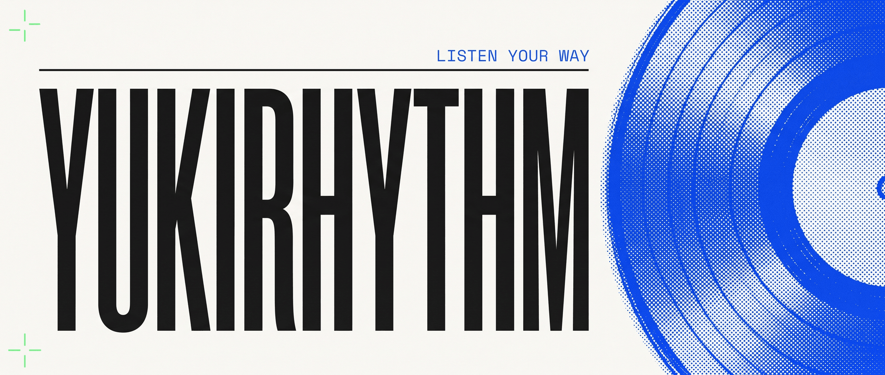
</picture>

<br>
<br>

**Free music, zero ads, zero interruptions.**
<br>
Your library, your queue, your volume. All remembered, every time you come back.

<br>

[](https://yukirhythm-web.vercel.app)

<br>


</div>

<br>

## What is this?

Yukirhythm is a music player for people who just want to **press play**. It streams
from YouTube's endless catalog: every song, every remix, every 3-hour lofi mix, all
wrapped in a fast, focused player with **no ads, no upsells, and no "premium" nags**.

Sign in once, and the app remembers everything: the song you were on, the second you
paused at, your queue, even your volume. Close the tab at 2:06 of a track, come back
tomorrow, and it's waiting at 2:06.

<br>

## How to use it

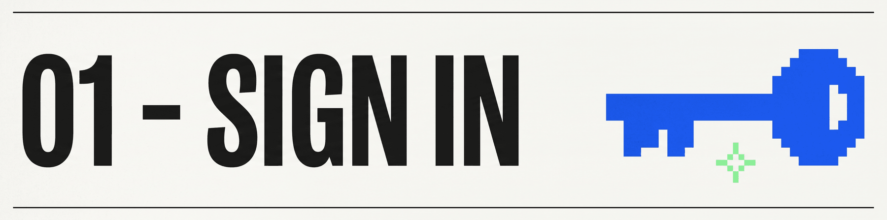

One tap. Continue with **Google** or **Facebook**. No forms, no passwords to invent,
no email verification scavenger hunt. Signing in is what lets Yukirhythm keep your
likes, playlists and session across devices.

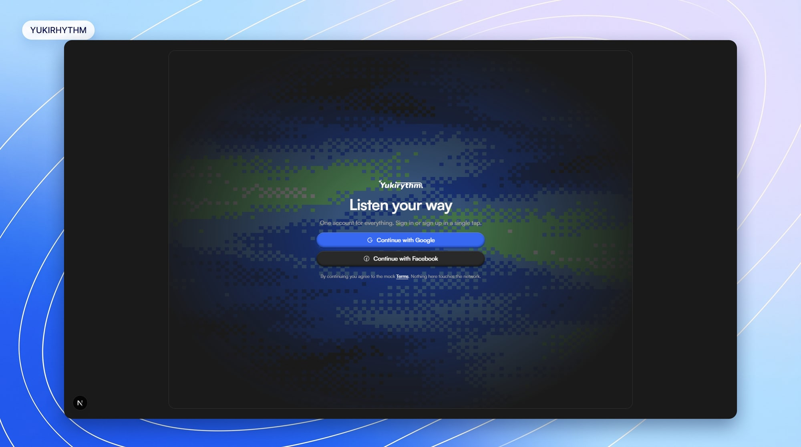

<br>

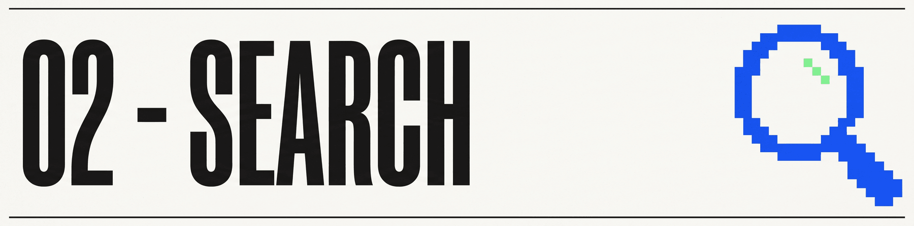

You land straight on **Search**, already filled with music:

1. **You might like**, picks that learn from what you play
2. **New releases**, fresh drops
3. **Browse by mood**, one-tap tiles: Lo-fi, Ambient, Focus, Night, and more

Type anything. A song, an artist, half a lyric you barely remember. Press
<kbd>Enter</kbd>, and if YouTube has it, you can play it.

> [!TIP]
> Searching only fires when you press <kbd>Enter</kbd>. Type in peace, with no
> flickering results while you think.

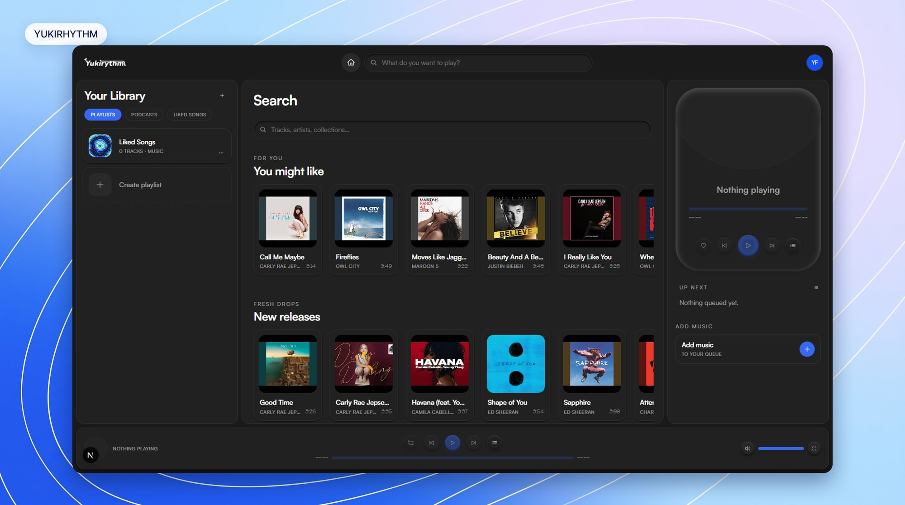

<br>

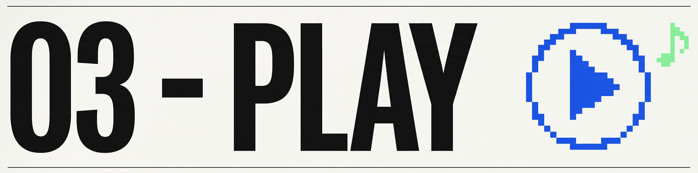

Click any card and it plays. The vinyl starts spinning in the player rail, with your
queue underneath.

- **Seek anywhere.** Click any point on the progress bar to jump straight to that second
- **Like from the player.** The ♥ sits right on the transport, one click while it spins
- **Queue it up.** Add tracks to play next or last, straight from any card's menu

> [!NOTE]
> Leave whenever you want. When you come back, your song is restored **paused at the
> exact second you left**, volume included. Press play and continue.

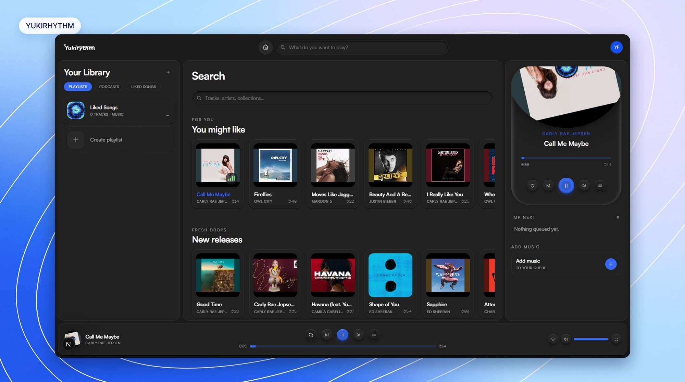

<br>

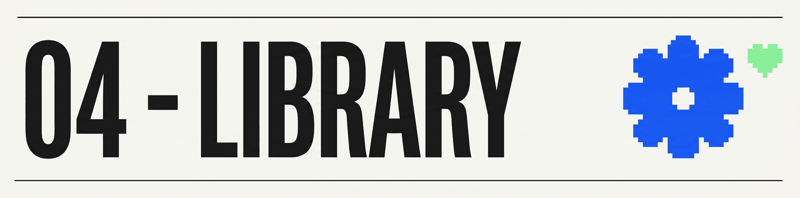

Everything you ♥ lands in **Liked Songs**, a permanent playlist that's always pinned.
Build your own playlists with the create flow (name, mood tags, cover), and add to
them from anywhere in the app.

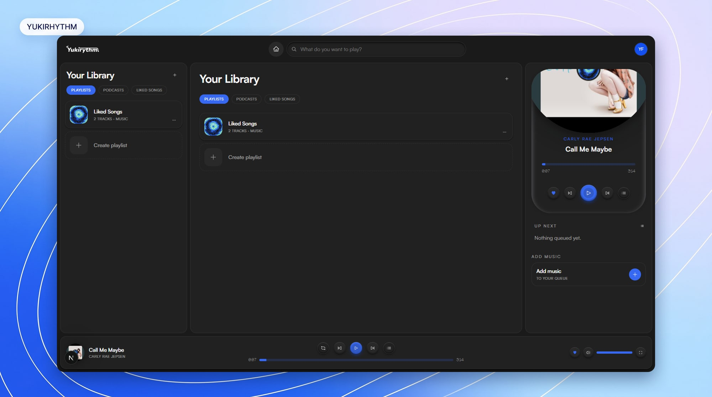

<br>

## Inside "You might like"

<div align="center">

**A personal radio built from what you actually play.**


</div>

Yukirhythm does not pull this shelf from a fixed editorial playlist. It learns
a compact taste profile from recent listening, explores several related music
sources, and blends the strongest results into one set of 15 songs.

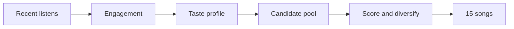

### 1. Read the listen

Every play becomes one engagement signal. More of the song heard means a
stronger vote for that sound:

| State             | What happened                  | Taste effect |
| :---------------- | :----------------------------- | -----------: |
| **Quick skip**    | Under 30 seconds               |      `-0.35` |
| **Sampled**       | 30 seconds to under 50%        |      `+0.45` |
| **Completed**     | At least 50%, but under 80%    |      `+1.00` |
| **Near-complete** | At least 80%                   |      `+1.20` |
| **Liked**         | Added on top of the play state |      `+0.60` |

> [!IMPORTANT]
> **Percentage wins for short tracks.** Hearing 10 seconds of a 20-second song
> counts as completed, not as a quick skip. If duration is unavailable, under
> 30 seconds is a quick skip and 30 seconds or more is sampled.

### 2. Build the taste profile

New behavior matters most. Each signal fades with a **14-day half-life** and
leaves the active taste window after **60 days**.

```text
recency    = 0.5 ^ (age in days / 14)
eventScore = recency * (engagement + like boost)
```

Repeated plays accumulate. Positive scores are normalized so the strongest
current track preference becomes `1.0`. From there, Yukirhythm derives track,
artist, and genre affinities and chooses up to six diverse radio seeds.

### 3. Explore related music

| Candidate source        | What it contributes                                      |
| :---------------------- | :------------------------------------------------------- |
| **YouTube Music radio** | Up to 10 related tracks for each recent seed             |
| **Co-listening**        | Tracks beside your liked songs in public collections     |
| **Genre matches**       | Catalog tracks from your three strongest recent genres   |
| **Cold start**          | Popular radio and searches when history is still limited |

Already-liked songs, songs in your own collections, and anything played in
the last seven days are removed before ranking. That keeps the shelf focused
on discovery instead of replaying your library back to you.

### 4. Rank and diversify

A song can earn points from several sources at once:

| Ranking signal        | Weight |
| :-------------------- | -----: |
| Radio similarity      | `0.45` |
| Genre affinity        | `0.25` |
| Artist affinity       | `0.15` |
| Co-listening strength | `0.10` |
| View-count tie-break  | `0.05` |

The first matching source supplies the reason shown with each result, such as
`Because you played ...`, `More ...`, or `Similar to ...`. The final pass
prefers no more than two songs per artist, then backfills the open positions
from the remaining ranked tracks until the shelf reaches 15.

### 5. Refresh when you want

The result is cached per user so Home and Search stay stable between visits.
New listening shapes the next generated set; **Refresh** rebuilds it immediately
from the latest history.

<br>

## Questions you might have

<details>
<summary><b>Is it really free? What's the catch?</b></summary>
<br>

It's free. No ads, no premium tier, no trial countdown. Yukirhythm is an independent
project built for the love of it. The music plays through YouTube's own embedded
player, so artists still get their plays counted.

</details>

<details>
<summary><b>Where does the music come from?</b></summary>
<br>

YouTube. Every track plays through YouTube's official embedded player behind the
scenes, which is why the catalog is effectively everything: releases, live
versions, remixes, full albums, DJ sets, that one bootleg with 40k views.

</details>

<details>
<summary><b>Do I need an account?</b></summary>
<br>

Yes, one tap with Google or Facebook. That's what makes your likes, playlists,
queue and session follow you between visits and devices.

</details>

<details>
<summary><b>Does it work on my phone?</b></summary>
<br>

Yes. The whole app is responsive. On mobile you get a bottom tab bar, a mini
player, and a full-screen player with the same spinning vinyl.

</details>

<br>

<details>
<summary><h3>🛠 For developers</h3></summary>


An npm-workspaces monorepo; the app lives in `apps/web` (Next.js App Router).
Firestore is only ever touched server-side through route handlers under
`apps/web/app/api/` (Firebase Admin, uid from the verified token); the browser
talks to the API only. Playback is YouTube's IFrame player hidden behind a
custom vinyl UI.

```bash
git clone https://github.com/ELATTAR-Ayoub/Yukirhythm.git
cd Yukirhythm
npm ci

cd apps/web
npm run emulator    # Firebase auth + firestore emulators (terminal 1)
npm run dev:emu     # the app, pointed at the emulators (terminal 2)
```

Then open `http://localhost:3000`. Sign-in works against the local auth
emulator, no production credentials needed.

```bash
npm test                 # unit suite
npm run test:integration # against the emulator
npm run typecheck && npm run lint && npm run format:check
```

</details>

<br>

<div align="center">

<picture>
  <source media="(prefers-color-scheme: dark)" srcset="docs/readme/hero-light.png">
  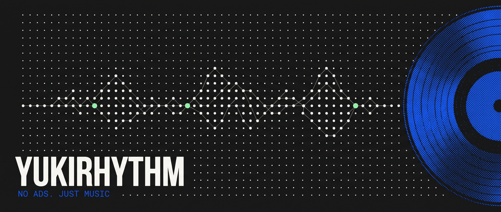
</picture>

<br>
<br>

Made with 🎵 by [ELATTAR Ayoub](https://github.com/ELATTAR-Ayoub)
<br>
<sub>If Yukirhythm made your day a little louder, a ⭐ makes mine.</sub>

</div>
